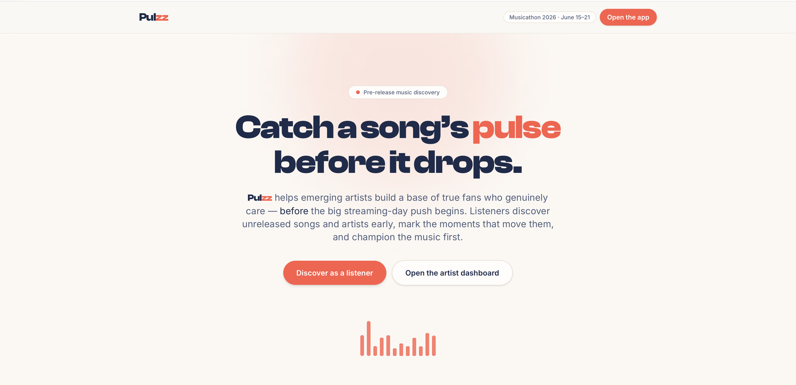

# Pulzz: Pre-Release Music Discovery

> **The Problem:** Streaming platforms are a crowded jungle where every new song has to fight for attention against bigger, more popular artists. Great songs often disappear before they can find early listeners, because they lack buzz, fans waiting on release day, and a place to be discovered first. Listeners also lose access to promising new artist talent, because the most exciting unreleased songs can be drowned out before they ever get a chance.
>
> **The Solution:** Pulzz creates a space *before* release day where emerging artists can build their first audience, and music lovers can discover the next great song before everyone else finds it.

---

## The Opportunity

### Why This Moment Matters

Artists face a harsh reality: streaming platforms are crowded, algorithms are unpredictable, and a song can disappear hours after it releases. The deciding factor is often not quality—it's whether listeners are already waiting.

Musicians don't just need distribution. They need **fair exposure before release day**. They need real listeners who connect with the music, talk about it, and commit to following the song when it officially launches.

Listeners face a parallel problem: they want to discover music before it becomes mainstream, to feel like they found something special before everyone else did.

**Pulzz bridges this gap.** It creates a discovery platform where unreleased songs find their early audience, and listeners become part of the song's story before it enters the streaming world.

---

## How It Works

### For Listeners: Discover Before Release

Listeners enter a mobile-first app where unreleased songs are presented as an active, participatory experience:

1. **Discover** — Browse unreleased tracks submitted by emerging artists
2. **React** — Mark songs as `Discovered` (will follow on release) or `Skip` (not for me)
3. **Mark Moments** — Tap to mark the exact seconds that moved them—a vocal peak, a beat drop, a lyric that hits
4. **Earn Recognition** — Discover points reward early-finder behavior
5. **Build a Profile** — Their discovery journey and taste become visible over time
6. **Return on Release Day** — Tap to stream the song directly when it officially launches

The listener doesn't passively consume. They become the first audience, and the artist sees exactly which moments resonated.

### For Artists: Build Buzz Before Launch

Artists use a web dashboard to transform pre-release time into momentum-building:

1. **Submit a Song** — Upload unreleased tracks with release date, story, lyrics, credits, and artwork
2. **Watch in Real-Time** — See how many listeners are discovering vs. skipping the track
3. **Analyze Moments** — Review which exact seconds listeners marked—revealing what worked
4. **Meet Early Listeners** — Build a group of supporters before the streaming release
5. **Find Collaborators** — Discover similar artists and request collaborations on a shared collaboration wall
6. **Make Decisions** — See whether a song is ready for release, or what might need rethinking

Instead of hoping for algorithm luck after release, artists now have signal *before* they release—and listeners who are already invested.

## Why Pulzz Is Different

**Most music platforms optimize for what happens *after* a song is public.**

Pulzz optimizes for what happens *before* release—the fragile, high-value moment when a song is finished but its audience hasn't been found yet.

This changes everything:

| Aspect | Traditional Platforms | Pulzz |
|--------|----------------------|-------|
| **Listener Role** | Passive consumer | Active first-audience member |
| **Artist Focus** | After release (algorithm luck) | Before release (building anticipation) |
| **Analytics** | Vanity metrics | Release-readiness signal |
| **App Experience** | Endless feed scroll | Intentional reaction loop with moment marking |
| **Release Day** | Starting from zero | Starting with waiting listeners |

---

## Partners & Integrations

Pulzz is built directly on top of three music-industry partner APIs. Each one powers a specific, working feature in the product — not a logo on a slide. Here's exactly how we use each.

### Cyanite — AI audio analysis (the "Song DNA" engine)

When an artist submits a track, Pulzz streams the audio to **Cyanite's** GraphQL API (`audioAnalysisV6`) and stores the returned profile: genre and mood distributions, BPM, musical key, energy level and dynamics, valence (positivity) and arousal (intensity), plus an AI caption and musical era. We use this in two places:

- **Song DNA** — every song's detail page in the artist dashboard renders this profile so artists see how their unreleased track actually sounds to a machine listener.
- **Taste-matched discovery & collaboration** — Pulzz turns each Cyanite profile into a normalized sound vector and ranks the listener's Discover feed by cosine similarity to their taste. The same similarity surfaces "similar artists" so creators can find collaborators whose sound fits theirs.

Results land asynchronously: we kick off analysis in the background and let Cyanite's webhook (plus a lazy re-fetch) fill in the finished profile.

### Musixmatch — lyrics, taste profiling & lyric intelligence

We use **Musixmatch's** API for three distinct jobs:

- **Onboarding taste capture** — the listener onboarding pulls Musixmatch's genre catalog and track search so new listeners pick real songs and genres they love, seeding their taste profile.
- **Synced lyrics in the player** — we fetch LRC subtitles and display them line-by-line, in sync with playback, while a song streams.
- **Lyric mood / theme / language** — each submitted song's lyrics get a mood, theme, and language read from Musixmatch's lyrics analysis (with a lightweight script-based language fallback), stored and shown alongside the track.

### Songstats — cross-platform performance (closing the loop)

An artist attaches an ISRC or Spotify link to a released song, and Pulzz queries **Songstats'** enterprise stats API to surface real cross-platform performance. We use it at two levels:

- **Per song** — total and recent streams, playlist reach, playlist counts, and chart activity for an individual released track.
- **Artist-wide rollup** — those numbers are aggregated across all of an artist's released songs and broken down **by streaming platform** (Spotify, Apple Music, Amazon Music, Deezer, YouTube, Shazam, and more) as well as by song, so an artist sees their overall reach across the streaming ecosystem in one place.

Pre-release songs are deliberately gated so they never show live numbers — connecting pre-release discovery to real post-release performance once a song goes live.

### Supporting data & assets

- **Internet Archive** — the demo catalog uses real public-domain recordings (audio and cover art) so the experience is populated with genuine music, legally.
- **Replit object storage** — stores and delivers artist-uploaded audio and artwork.

Every integration degrades gracefully: if a partner key is absent or a lookup has no data, the corresponding feature shows a tasteful fallback instead of breaking.

---

## For Judges

### What Problem Does This Solve?

**The Pre-Release Gap:** Musicians release songs into a crowded streaming world with no early listeners and no buzz. Algorithms won't help them. They need people waiting on day one. At the same time, listeners lose the chance to discover rising talent before it is swept away by the mainstream. Pulzz fills that gap by creating a discovery platform that launches *before* the official release, so artists have time to build their first audience and listeners feel like discoverers.

### What's Innovative?

1. **Moment Marking** — Listeners don't just react; they mark the exact seconds that moved them, giving artists hyper-detailed feedback
2. **Pre-Release Focus** — Every feature is optimized for the fragile pre-release window, not the post-release competition
3. **Collaborator Discovery** — Artists can find similar creators, connect on a collaboration wall, and request joint projects before release
4. **Full Platform** — Not just a submission tool; a complete two-sided marketplace with mobile, web, and analytics
5. **Real Signal** — Artists see which songs are connecting, which moments stick, and whether launch-day listeners are forming

---

**Built for Musicathon 2026** — Giving emerging artists a fair chance before release day.
